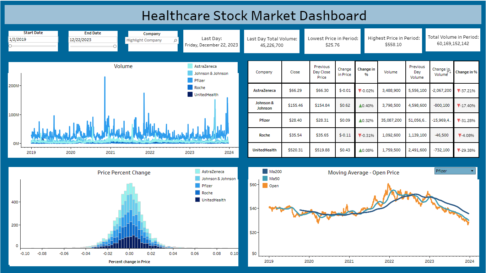

<!DOCTYPE html>
<html lang="en">
<body>

<header>
   <h1>Healthcare Stock Market Analysis</h1>
</header>

<section id="overview">
    <h2>Overview</h2>
    
This project involves the extraction and analysis of historical stock data from five different companies in the healthcare sector: JNJ, PFE, UNH, RHHBY, AZN. The primary goal is to gain insights into the stock performance of these companies over time. Historical stock data was obtained using the Yahoo Finance API ('yfinance'). The analysis is conducted using Python's Pandas library for data manipulation and visualization, and an interactive dashboard is created using Tableau.

   
 <b>JNJ</b> (Johnson & Johnson): A diversified healthcare company involved in pharmaceuticals, medical devices, and consumer goods. They are known for products like Band-Aid, Tylenol, and prescription drugs.

   
 <b>PFE</b> (Pfizer): A pharmaceutical company known for developing and manufacturing a wide range of medications, including vaccines, oncology drugs, and various therapeutic areas.

   
 <b>UNH</b> (UnitedHealth Group): A health insurance and healthcare services company. They operate through various subsidiaries, providing health benefits and servicesto individuals and businesses.

   
 <b>RHHBY</b> (Roche Holding AG): A Swiss multinational healthcare company specializing in pharmaceuticals and diagnostics. They are known for drugs in oncology, immunology, infectious diseases, and other therapeutic areas.

   
 <b>AZN</b> (AstraZeneca): A global biopharmaceutical company focused on the discovery, development, and commercialization of prescription medicines. They are known for their contributions in areas such as cardiovascular, respiratory, and oncology drugs, as well as vaccines.

</section>

<section id="methodology">
<h2>Analysis</h2>
<h3>Stock Price and Moving Averages</h3>

Data for each ticker symbol includes daily closing prices, which are aggregated over the past 5 years. Moving averages were calculated to smooth out price fluctuations and identify trends. Specifically, the 50-day and 200-day moving averages are computed for each stock. The plots reveal the historical stock prices for each ticker symbol, alongside their respective 50-day and 200-day moving averages. Trends and patterns in stock prcie movements are identified, aiding in the interpretation of long-term performance.

<h3>Weekly Returns</h3>

Weekly returns are calculated to assess the performance of each stock over shorter time intervals. The weekly return is computed as the percent change in stock price from one week to the next. Weekly return plots depict the volatility and performance of each stock on a weekly basis. Fluctuations in weekly returns provide insights into the stock's sensitivity to market conditions and external factors.

</section>

<section id="data-manipulation">
    <h2>Data Extraction and Manipulation</h2>
    <ol>
        <li>Data Sources:
            <ul>
                <li>Historical stock data for five healthcare companies from Yahoo Finance</li>
            </ul>
        </li>
        <li>Data Manipulation with Pandas:
            <ul>
                <li>Pandas is used to manipulate the data efficiently.</li>
                <li>New columns are generated, including moving averages, percent change in price, and percent change in volume.</li>
            </ul>
        </li>
    </ol>
</section>

<section id="tableau-dashboard">
    <h2><a href="https://public.tableau.com/app/profile/nate.talampas/viz/HealthStockMarket/Dashboard1">Tableau Interactive Dashboard</a></h2>
   
    <ol>
        <li>Dashboard Creation:
            <ul>
                <li>An interactive dashboard is crafted in Tableau to visualize the stock data comprehensively.</li>
            </ul>
        </li>
        <li>Key Features in Dashboard:
            <ul>
                <li>Stock Volume: Visual representation of each company's stock volume over the selected period.</li>
                <li>Price Percent Change: Highlighting the percentage change in stock prices.</li>
                <li>Moving Averages: Displaying moving averages to smoothen stock price trends.</li>
         
