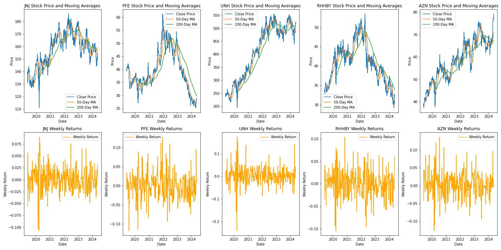

<!DOCTYPE html>
<html lang="en">
<body>

<header>
   <h1>Healthcare Stock Market Analysis</h1>
</header>

<section id="overview">
    <h2>Overview</h2>
    
This project involves the extraction and analysis of historical stock data, retrieved using the Yahoo Finance API ('yfinance'), from five different companies in the healthcare sector: JNJ, PFE, UNH, RHHBY, AZN. The primary goal is to gain insights into the stock performance of these companies over time.

   
 <b>JNJ</b> (Johnson & Johnson): A diversified healthcare company involved in pharmaceuticals, medical devices, and consumer goods. They are known for products like Band-Aid, Tylenol, and prescription drugs.

   
 <b>PFE</b> (Pfizer): A pharmaceutical company known for developing and manufacturing a wide range of medications, including vaccines, oncology drugs, and various therapeutic areas.

   
 <b>UNH</b> (UnitedHealth Group): A health insurance and healthcare services company. They operate through various subsidiaries, providing health benefits and servicesto individuals and businesses.

   
 <b>RHHBY</b> (Roche Holding AG): A Swiss multinational healthcare company specializing in pharmaceuticals and diagnostics. They are known for drugs in oncology, immunology, infectious diseases, and other therapeutic areas.

   
 <b>AZN</b> (AstraZeneca): A global biopharmaceutical company focused on the discovery, development, and commercialization of prescription medicines. They are known for their contributions in areas such as cardiovascular, respiratory, and oncology drugs, as well as vaccines.

</section>

<section id="methodology">
<h2>Analysis</h2>
<h3>Stock Price and Moving Averages</h3>

Data for each ticker symbol includes daily closing prices, which are aggregated over the past 5 years. Moving averages were calculated to smooth out price fluctuations and identify trends. Specifically, the 50-day and 200-day moving averages were computed for each stock. The plots reveal the historical stock prices for each ticker symbol, alongside their respective 50-day and 200-day moving averages. Trends and patterns in stock price movements can be observed, aiding in the interpretation of long-term performance.

<h3>Weekly Returns</h3>

Weekly returns are calculated to assess the performance of each stock over shorter time intervals. The weekly return is computed as the percent change in stock price from one week to the next. Weekly return plots depict the volatility and performance of each stock on a weekly basis. Fluctuations in weekly returns provide insights into the stock's sensitivity to market conditions and external factors.

</section>

### Principal Component Analysis
The weekly rates of return for Johnson & Johnson, Pfizer, UnitedHealth Group, Roche Holding AG, and AstraZeneca were determined for the period May 2019 through May 2024. The observations appear to be independently distributed, but the rates of return across stocks are correlated, because stocks tend to move together in response to general economic condtions.

Let $x_1, x_2, ..., x_5$ denote observed weekly rates of return. The sample mean vector and the sample correlation matrix are:

$\vec{\bar{x'}} = [0.000667, -0.000614, 0.003747, 0.000287, 0.003360]$

The principal components are:

$Y_1 = 0.4838X_1 + 0.4326X_2 + 0.4253X_3 + 0.4390X_4 + 0.4530X_5$ 
$Y_2 = 0.2099X_1 + 0.3372X_2 + 0.5276X_3 -0.5694X_4 -0.4895X_5$ 
$Y_3 = -0.0430X_1 + 0.7417X_2 -0.5976X_3 -0.2605X_4 + 0.1513X_5$ 
$Y_4 = 0.8485X_1 -0.2943X_2 -0.4021X_3 -0.1274X_4 -0.1241X_5$ 
$Y_5 = -0.0064X_1 -0.2499X_2 + 0.1476X_3 -0.6316X_4 + 0.7189X_5$

The proportion of the total sample variance explained by the first three principal components is computed as:

$(2.8737 + 0.7082 + 0.5809) / 5 = 0.83256$

- The first principal component is a measure of the rates of return for **JNJ**, **PFE**, **UNH**, **RHHBY**, and **AZN**.
- The second principal component is a measure of the rates of return for **UNH**, **RHHBY**, **AZN**, and to some extent, **JNJ**, and **PFE**.
- The third principal component is a measure of the rates of return for **PFE**, **UNH**, and to some extent, **RHHBY**.
</section>

<section id="forecast">
   <h2>ARIMA Time Series Forecasting</h2>
   
An ARIMA model, which stands for AutoRegressive Integrated Moving Average, is a popular and powerful statistical method used for time series forecasting. The ARIMA model is characterized by three parameters: $p, d, q$, which are used to capture different aspects of the time series data. Here’s what each parameter represents:

   <b>AutoRegressive (AR) part</b>: This component involves regressing the variable on its own lagged (prior) values. <b>p</b> is the number of lag observations included in the model (or the number of lagged terms).
   
   <b>Integrated (I) part:</b> This component involves differencing the data to make it stationary. Stationary data has a constant mean and variance over time, which is a requirement for many time series models. Differencing is the process of subtracting the previous observation from the current observation. <b>d</b> is the number of times that the raw observations are differenced (or the degree of differencing).

   <b>Moving Average (MA) part:</b> This component involves modeling the error term as a linear combination of error terms occurring at various times in the past. <b>q</b> is the size of the moving average window (or the order of the moving average part).

   An ARIMA(2, 1, 2) model was chosen to model the stock price of UNH based on the characteristics of the time series data. This model incorporates two lagged observations in the autoregressive part (p=2), applies first-order differencing to achieve stationarity (d=1), and includes two lagged forecast errors in the moving average part (q=2)
   

   The fitted ARIMA(2, 1, 2) model for the stock price of UNH is given by:

   $Y_t - Y_{t-1} = -1.7235 (Y_{t-1} - Y_{t-2}) - 0.9058 (Y_{t-2} - Y_{t-3}) + e_t + 1.6532 e_{t-1} + 0.8442 e_{t-2}$

   where $e_t$ is the error term with variance $\sigma^2 = 43.0813$.

   

   

   Date|Forecasted Close Price|Lower CI (95%)|Upper CI (95%)
   ----|----------------------|--------------|--------------
   2024-05-22|522.877482|510.013001|535.741962
   2024-05-23|523.287144|505.721939|540.852349
   2024-05-24|523.190222|501.499404|544.881041
   2024-05-25|522.986207|498.087606|547.884807
   2024-05-26|523.425621|495.612449|551.238793
   2024-05-27|522.853074|492.337088|553.369060
   2024-05-28|523.441859|490.605521|556.278197
   2024-05-29|522.945676|487.730865|558.160486
   2024-05-30|523.267551|486.037542|560.497559
   2024-05-31|523.162224|483.843885|562.480563
   2024-06-01|523.052210|481.867892|564.236529
   2024-06-02|523.337223|480.322144|566.352302
   2024-06-03|522.945645|478.153465|567.737826
   2024-06-04|523.362379|476.934185|569.790574

   

   
</section>

<section id="tableau-dashboard">
    <h2><a href="https://public.tableau.com/app/profile/nate.talampas/viz/HealthStockMarket/Dashboard1">Tableau Interactive Dashboard</a></h2>
   
    <ol>
        <li>Dashboard Creation:
            <ul>
                <li>An interactive dashboard is crafted in Tableau to visualize the stock data comprehensively.</li>
            </ul>
        </li>
        <li>Key Features in Dashboard:
            <ul>
                <li>Stock Volume: Visual representation of each company's stock volume over the selected period.</li>
                <li>Price Percent Change: Highlighting the percentage change in stock prices.</li>
                <li>Moving Averages: Displaying moving averages to smoothen stock price trends.</li>
         
